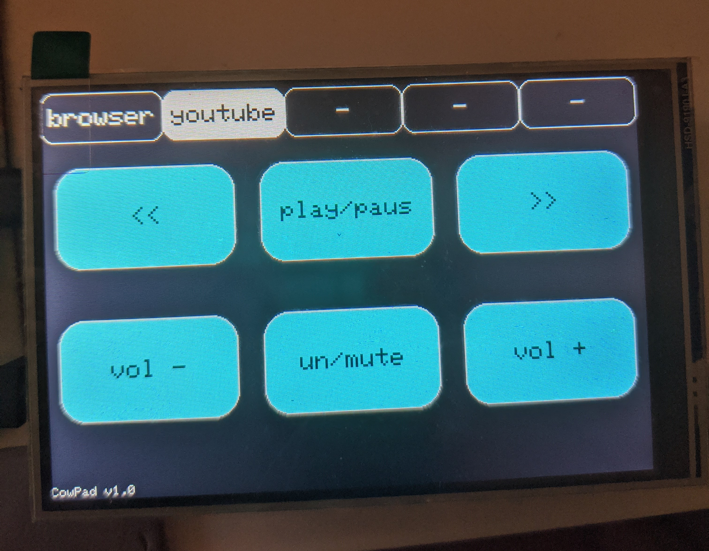

# cowpad

A program for a macropad functionality built with an Arduino MEGA 2560 and a TFT resistive touchscreen.

Sends keypresses based on button press.

## component list

- Arduino MEGA 2560
 
- 3.95" inch 480*320 TFT Touch LCD Module Screen Display Panel ST7796S Controller

## instructions

1. flash cowpad.ino to your arduino.

2. plug in the pad and run the python script.

## configuration settings

- IMPORTANT: edit the settings.json file to customize your macros.

- Remember to install the libraries specified on the top of the .ino file.

- You might have to run calibration on the screen using the example arduino code for touchscreens.
Replace the values in the .ino file with the results you get from the calibration.
